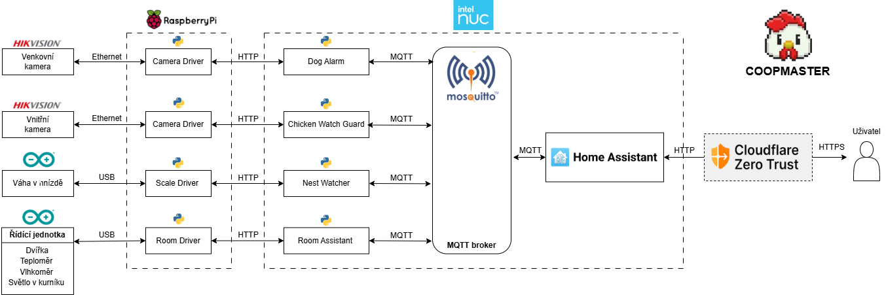

# CoopMaster

Coopmaster je pokročilý asistenční systém pro automatizaci a zefektivnění chovu hospodářských zvířat, testovaný na chovu
kura domácího.
Využívá moderních technologií, včetně zpracování obrazu pomocí neuronových sítí, mikroservisní architektury a open
source softwaru Home Assistant. Díky nim zajišťuje vyšší úroveň bezpečnosti a minimalizuje nutnost fyzické přítomnosti
chovatele.
Propojení hardwaru a softwaru tvoří komplexní řešení od vývoje funkčních dvířek a digitálních vah až po intuitivní
mobilní i webovou aplikaci s podporou vzdáleného přístupu.
Systém v reálném čase monitoruje stav a aktivitu slepic, kontroluje hnízda a odhaluje případné vetřelce ve výběhu.
Díky neustálému monitorování hmotnosti hnízd systém poskytuje chovateli aktuální přehled o snůšce vajec v kurníku.
Součástí řešení je také rozsáhlý monitoring a tvorba statistik, které uživatelům poskytují přehled o dlouhodobých
trendech, produkci vajec či stavu hejna.
Projekt je nasazen a používán v reálném provozu. Přináší chovatelům vyšší komfort a zlepšuje blahobyt zvířat.
Přestože je v některých oblastech prostor pro další optimalizace a zlepšení, představuje tento projekt významný krok
vpřed ve vývoji moderních řídících a automatizačních systémů pro chov hospodářských zvířat.

## Popis fungování
Jako teoretický model pro organizaci funkcionalit, je zvolena mikroservisní architektura.
Programovacím jazykem pro tvorbu služeb je zvolen programovací jazyk Python.
Pro realizaci, konfiguraci a síťování mikroservisní architektury je použit Docker Engine společně s rozšířením Docker Compose.
Na základě předchozích rozhodnutí je systém rozdělen do jednotlivých mikroslužeb tak, aby vznikla robustní a rozšiřitelná mikroservisní architektura a byly splněny všechny uživatelské požadavky, které jsme si určili.
Systém obsahuje 8 služeb. Tyto služby společně s hardwarovými prvky tvoří systém Coopmaster.

### Health Checker

Health Checker je malá služba určená pro správce systému.
Poskytuje informace o tom, zda všechny služby běží, aby správce nebyl nucen přihlašovat se vzdáleně na server a manuálně
kontrolovat každou službu.
Výpis stavů jednotlivých služeb je poskytován pomocí jednoduché webové stránky.

#### Popis algoritmu

Po nastartování služby je spuštěno REST API na portu 9000 pro komunikaci se správcem.
Jediným endpointem služby je <server:port>/status.
Pokud uživatel pomocí prohlížeče pošle GET požadavek na tuto službu, bude mu vrácen seznam služeb a jejich stavů
převedený do formátu JSON.
Stavem aplikace je myšlen status kód a případné chybové hlášky, které služby po zavolání jejich metody <server:port>
/ping.

Seznam služeb, které má Health Checker kontrolovat, je načítán z konfiguračního souboru při startu služby.
Jednotlivé služby jsou v seznamu identifikovány na základě IP adresy a portu.

Algoritmus funguje na základě plánovače úloh neboli scheduleru, který jednou do minuty spustí kontrolu všech služeb a
jejich stavy uloží do seznamu odkud jsou pak načítány při požadavku na API.
Kontrola se provádí právě posláním HTTP požadavku na <server:port>/ping každé služby a následným uložením odpovědi.

Tento modul umí poskytovat základní informace o aktuálním stavu služeb sytému Coopmaster.
Pokud by se v budoucnu objevil požadavek na historická data, bylo by velmi jednoduché integrovat tuto komponentu s
některou z open source platforem určenou pro analytiku a vizualizaci dat.
Například Grafana umožňuje uživatelům vytvářet interaktivní a dynamické panely (dashboardy), které vizualizují různorodé
časové řady dat získané z různých zdrojů.

- https://github.com/JarousNemec/coopmaster-health-checker

### Camera Driver

Camera Driver je služba zodpovědná za zprostředkování komunikace mezi IP kamerami a službami zpracovávajícími obraz.

#### Popis algoritmu

Po startu služby naběhne REST API na portu 9001 vytvořené za pomoci Python frameworku Flask.
Toto API poskytuje endpoint pro získání aktuálního snímku z každé kamery, která je službě přiřazena v konfiguraci
modulu.
S kamerami pak služba komunikuje pomocí HTTP protokolu.
Byla zvažována i možnost využití protokolu RTSP, ale jelikož moje řešení prozatím nemá vysoké nároky na živý přenos,
ukázala se jako lepší volba využití REST API kamery, které umožnuje stační aktuálního snímku na požádaní.
Jakmile je přijat požadavek na získání aktuálního snímku z konkrétní kamery, služba za pomocí GET requestu stáhne obraz
z restového API síťové kamery a vrátí ho ve FullHD rozlišení jako odpověď na HTTP dotaz.
Endpoint kamery ze kterého má služba obrázek stahovat, získá z konfigurace předávané pomocí systémových proměnných.
Kamery mají vlastní zabezpečení proti neoprávněnému přístupu k datům.
V případě ověřování HTTP komunikace se používá metoda Digest Access Authentication, pomocí které je kameře předáváno
uživatelské jméno a heslo.

- https://github.com/JarousNemec/coopmaster-camera-driver

### Scale Driver

Scale driver zodpovídá za komunikaci mezi fyzickou váhou a službami, které využívají data o vážení.

Jako řídící jednotka váhy je použito Arduino.
Scale driver modul je připojen USB kabelem a komunikuje přes sériový port.
Pomocí jednoduchého proprietálního protokolu a na přijatý dotaz poskytne jako odpověď aktuální hodnotu načtenou ze
senzoru váhy.
Scaler driver má vystavené REST rozhraní, které umožnuje komunikaci s ostatními komponentami systému.

#### Popis algoritmu

Nejprve naběhne hlavní vlákno, které se stará o poskytování REST API na portu 9004.
Toto API obsahuje endpoint pro vrázení aktuální hmotnosti na váze pomocí požadavku s metodou GET.
Následně je spuštěno nové vlákno, které má za úkol číst data z váhy a předávat je aplikačnímu rozhraní jako aktuálně
naměřenou hmotnost na váze, jež se bude od teď poskytovat, pokud o ní někdo GET requestem požádá.
Čtení informací z váhy se provádí v nekonečném cyklu.
Před začátkem cyklu se do log souboru zapíše informace ohledně úspěšného spuštění nového vlákna.
Poté proběhne otevření komunikace s váhou přes seriový port s využitím knihovny PySerial.
Po úspěšném otevření spojení se váze vždy po uplynutí časového intervalu 2 sekundy, odešle znak "w".
Tento znak je ve firmwaru váhy veden jako příkaz, po jehož přijetí má váha vrátit aktuální naměřenou hodnotu.
Časové zpoždění je implementováno kvůli tomu, že není třeba číst data tak často a zároveň by mohlo docházet k zahlcení
váhy.
Jakmile je celá odpověď od váhy přijata programem zpět, jsou data zvalidována a následně, pokud je to možné, převedena
na datový typ Int.
Datový typ Int je zvolen z důvodu, že váha posílá data v gramech a je zbytečné v tomto případě používat desetinná čísla,
protože gramy poskytují dostatečné rozlišení pro naše účely.
Pokud se nepodaří převézt přečtenou hodnotu na číslo, je výstupní proměnná nastavena na -1, což zbytku systému naznačí,
že váha není v pořádku.
Na závěr se zalogují aktuálně získaná data a následuje další volání cyklu.

- https://github.com/JarousNemec/coopmaster-scale-driver

### Room Driver

Room Driver zajišťuje komunikaci mezi službou Room Assistant a řídící jednotkou v kurníku.
Tato jednotka se stará o ovládání dveří, světla a poskytování dat o aktuální teplotě a vlhkosti.
Ovládání nízkoúrovňových komponent a komunikaci s připojeným počítačem zajišťuje Arduino Nano.
Arduino je připojeno pomocí USB sběrnice k počítači, který na základě domluvených pravidel jednoduchého komunikačního
protokolu posílá znaky, na které Arduino příslušně reaguje dle programu.
Tato služba má tedy za úkol přes sériové rozhraní posílat příkazy a načítat stavy řídící jednotky na základě požadavků
přijatých na REST API.

#### Popis algoritmu

Po startu služby se nejdříve vytvoří instance třídy ArduinoReader.
Jedná se o vlastní třídu, při inicializaci vytvoří instanci sériového spojení k Arduinu.
Je zde implementován connection pool, který se stará o zdraví spojení po celou dobu běhu aplikace.
Třída má jedinou metodu, a tou je run_command.
Tato metoda přijímá jako parametr jeden znak, který při provolání metody pošle zkrze sériové připojení do Arduina a
vrátí data typu String, kterými odpoví Arduino zpět.
Jakmile se povede provést inicializaci sériového spojení je spuštěno REST API na portu 9005.
Toto API poskytuje endpointy pro vyslání příkazů k zavření a otevření dvířek, zhasnutí a rozsvícení světla, informací o
aktuálních stavech jednotky a informací o teplotě a vlhkosti v kurníku.
Informace o aktuálním stavu jsou dobré pro případ, kdy se budou muset služby restartovat a bude třeba načíst reálný
aktuální stav.
V případě, kdy přijde požadavek na konkrétní endpoint, jako první věc se provede odeslání příslušného znaku jako příkaz
Arduinu.
Následně se počká na jeho odpověď, pokud je požadavek typu POST.
Odpověď je následně převedena do JSON objektů a vrácena v HTTP odpovědi s typem těla odpovědi JSON.

#### Příkazy ovládacího protokolu

    - o = otevřít dvířka
    - c = zavřít dvířka
    - l = rozsvítit světlo
    - d = zhasnout světlo
    - j = vrátí zprávu ve formátu JSON s daty o teplotě a vlhkosti
    - s = vrátí zprávu ve formátu JSON s daty o stavech jednotlivých ovládaných prvků (dveře, světlo)

- https://github.com/JarousNemec/coopmaster-room-driver

### Dog Alarm

Jednou z klíčových komponent systému Coopmaster je služba pro ochranu slepic před potenciálním nebezpečím ve výběhu,
nesoucí název Dog Alarm.
Za využití modelu Yolo11 služba detekuje vetřelce (psa) na fotkách z kamery ve výběhu a informuje pomocí MQTT protokolu
chovatele do systému Home Assistant.

#### Obecný princip

Jako zdroj dat je použit kamerový systém ve výběhu, který je reprezentován službou Camera Driver.
Z této služby pak Dog Alarm stahuje pomocí GET požadavků fotografie z kamery ve výběhu.

Pro detekci predátorů je využito modelu Yolo11.
Model je velmi kvalitně vyučený a společnost Ultralytics k němu nabízí rozsáhlou dokumentaci, což je také jeden z
hlavních důvodů mojí volby.
Před nasazením jsem model ještě doučil o další fotografie psa pořízené z venkovní kamery, aby se model více přizpůsobil
podmínkám vstupních fotografií.

Jakmile model identifikuje přítomnost psa nebo jiného predátora, služba Dog Alarm okamžitě vygeneruje výstrahu.
Tato výstraha je odeslána pomocí protokolu MQTT do systému Home Assistant.
Spolu se zprávou je připojen specifický záběr, na kterém byl predátor detekován, aby mohl chovatel zhodnotit situaci
sám.

Kromě výstražných zpráv, Dog Alarm pravidelně zasílá aktuální záběry z kamery do Home Assistanta, čímž umožňuje
uživatelům mít průběžný přehled o situaci ve výběhu.

#### Popis algoritmu

Po startu služby se inicializuje REST API vytvořené pomocí Flask frameworku.
Toto API poskytuje endpoint pro volání služby Health Checker s dotazem na stav služby.
Následně je spuštěn scheduler, který má za úkol jednou za minutu spustit úkol s názvem check_dog.
Jako poslední je spuštěno poskytování REST API na portu 9008.newline

#### Popis algoritmu pro detekci vetřelců

Tento úkol běží v pravidelných intervalech detekuje vetřelce v obraze a stará se o report informací.
Prvním krokem je stažení aktuálního snímku z kamery ve výběhu.
Další následuje načtení příslušného Yolo modelu dle konfigurace.
Následně je provedena detekce objektů v obraze.
Výsledný seznam detekovaných objektů se analyzuje a zjistí se, zda obsahuje kategorii pes.
Na závěr se předávají aktuální výsledky na MQTT server.
Pokud byl detekován pes posílá se zpráva na topic coopmaster/dog/detected.
Dále posíláme aktuální obrázek na topic coopmaster/dog/image/actual.
Tyto MQTT topics odebírá systém Home Assistant a dále s nimi pracuje.

- https://github.com/JarousNemec/coopmaster-dog-alarm

### Chicken Watch Guard

Služba Chicken Watch Guard je dalším klíčovým prvkem systému Coopmaster.
Poskytuje data o počtu slepic v kurníku a tato data předává do systému Home Assistant.

#### Obecný princip

Podobně jako u služby Dog Alarm, Chicken Watch Guard používá kamerový systém pro získávání aktuálních záběrů z kurníku.
Tyto záběry jsou staženy ze služby Camera Driver.
Získané obrázky se analyzují modelem Yolo11, který je upravený pro přesnější detekci v našich lokálních podmínkách.
Výsledky detekce společně s aktuální fotografií jsou pomocí protokolu MQTT odeslány do systému Home Assistant, který je
využije při automatizaci dvířek a vizualizuje v uživatelském rozhraní.

#### Popis algoritmu

Jako první je vytvořeno API definované pomocí Flask frameworku pro komunikaci se službou Health Checker.
Následně je inicializován a spuštěn scheduler, který má za úkol jednou za minutu spustit job s názvem check_chicken.
Závěrem spouštěcí metody se spustí propagace API na portu 9003, který je předáván jako proměnná prostředí při startu
služby.

#### Popis algoritmu pro počítání slepic

Po spuštění se jako první provolá metoda get_image, která je zodpovědná za stažení aktuálního obrázku ze služby Camera
Driver.
Dále je inicializován detekční upravený model Yolo11 a provedena detekce objektů v obraze.
Výsledkem je seznam objektů, které se podařilo identifikovat.
Hlavními daty, která obsahuje jedna položka v seznamu, jsou informace o detekované kategorii a oblast v obraze, kde
přesně byl objekt nalezen.
Počet slepic v kurníku je dán počtem, kolikrát se v seznamu výskytuje kategorie slepice.
Job končí publikováním výsledného počtu slepic na MQTT topic "coopmaster/chicken/count"
a aktuální fotografie na MQTT topic "coopmaster/chicken/image/actual".
Systém Home Assistant je MQTT subscriber zmíněných topics a reaguje na ně.

- https://github.com/JarousNemec/coopmaster-chicken-watch-guard

### Nest Watcher

Tato služba interpretuje stavy jednotlivých hnízd v kurníku pro Home Assistanta.
Úkolem této služby je načítání a analýza dat z jednotlivých hnízd v kurníku.
Každé hnízdo je reprezentováno jednou instancí služby Scale Driver.
V aktuální situaci služba obsluhuje šest hnízd, přičemž se data z každého hnízda monitorují a vyhodnocují.
Toto komplexní sledování umožňuje efektivní řízení kurníku, zajišťuje optimální péči o slepice a včasný sběr vajec.
Přístup založený na datech zvyšuje naši schopnost udržovat zdravé slepice a maximalizovat jejich produktivitu.

#### Popis algoritmu

Data jsou načítána několikrát za minutu a ukládána do databáze s časovým údajem, kdy byl záznam vytvořen.
Záznam v databázi obsahuje následující sloupce:

- id - jednoznačný identifikátor záznamu v databáze.
- nest_id - dentifikační číslo hnízda
- weight - naměřená hmotnost v gramech pro dané hnízdo
- timestamp - čas vytvoření záznamu

Následně se jednou za minutu vyhodnotí průměrná hodnota během posledních několika vážení.
Na základě vyhodnocené průměrné hmotnosti jsme schopni zjistit několik hlavních stavů hnízda:

- Hnízdo je prázdné - pokud průměrná hmotnost nepřevyšuje 50 gramů (vzhledem k možným chybám měření), vyhodnotíme, že
  hnízdo je prázdné.
  V hnízdě není ani slepice, ani vejce.
- V hnízdě se nacházejí vejce - jestliže se hodnota hmotnosti pohybuje mezi 50 a 1200 gramy, znamená to, že v hnízdě
  jsou pravděpodobně vejce.
  Hmotnost jednoho vejce je přibližně 50 gramů, takže počet vajec lze vypočítat vydělením celkové hmotnosti hmotností
  jednoho vejce.
- V hnízdě sedí slepice - pokud je průměrná hmotnost na váze více než 1200 gramů, vyhodnotí služba, že v hnízdě sedí
  slepice.
  Hmotnost slepice se pohybuje kolem 1200 gramů a více.

Výsledná data pro jednotlivá hnízda služba pomocí MQTT protokolu předává do systému Home Assistant, aby je zpracoval a
vizualizoval chovateli.

- https://github.com/JarousNemec/coopmaster-nest-watcher

### Room Assistant

Room Assistant zpřístupňuje komunikaci mezi systémem Home Assistant a službou Room Driver.
S Home Assistantem je komunikace realizována pomocí MQTT a s Room driverem pomocí HTTP protokolu.
Tato služba zpřístupňuje do systému Home Assistant data o teplotě a vlhkosti a Home Assistant přes ni ovládá světlo a
dvířka.
Při vývoji, ale i při provozu si můžeme zprávy prohlížet pomocí klientských aplikací.

#### Popis algoritmu

Po odstartování služby se stane hned několik věcí.
Jako první naběhnou MQTT subscribery pro přijímání příkazů ze systému Home Assistant.
Jeden přijímá příkazy pro dvířka, druhý pro světlo.
Vytvoří se vlastně instance dvou tříd LampTimeChecker a DoorTimeChecker.
Tyto instance mají každá svou instanci třídy NestMQTTClient, která zaobaluje základní funkcionalitu ohledně používání
protokolu MQTT.
NestMQTTClient zaobaluje metody pro publikování a odebírání zprávy, připojení a odpojení od MQTT brokeru, reakci na
navázané spojení s MQTT brokerem a reakci na odebrání nové zprávy.
LampTimeChecker odebírá topic coopmaster/room/lamp/cmnd a zpracovává zprávu pokud je jejím obsahem "on" nebo "off".
Na základě přijatého obsahu zprávy se zavolá statická metoda call_room_driver_command() třídy driver_client, aby
odeslala příslušný příkaz do Room Driveru na endpoint, který je předáván jako parametr.
DoorTimeChecker funguje stejně jako NestMQTTClient, ale odebírá topic coopmaster/room/door/cmnd a reaguje pokud je obsah
MQTT zprávy "open" nebo "close".
Po startu se rozběhne BackgroundScheduler, který má za úkol vždy po uplynutí 5 vteřin spustit nový běh akce pro
aktualizování stavů z řídící jednotky.
Podmínkou pro spuštění nového běhu jobu je, že předchozí běh je dokončen.
Tuto funkci má již v sobě implementovanou scheduler z knihovny APScheduler, který využívám.
Akce pro aktualizaci obsahuje jednu metodu a to detect_hardware_state().
Tato metoda nejdříve stáhne data z Room Driveru.
Následně načte z konfigurace topic pro stav dvířek, stav světla, teplotu a vlhkost.
Dále jsou pak data z Room Driveru zveřejněna na téma daná kofigurací, odkud je přijímá systém Home Assistant a
vizualizuje je.

- https://github.com/JarousNemec/coopmaster-room-assistant

### Váha

Pro účely projektu bylo potřeba postavit digitální váhu.
Tato váha má být umístěna v každém hnízdě v kurníku, kde slepice snáší vejce, a jejím úkolem je přes USB
poskytovat aktuální data o tom, jakou hmotností je zatěžována podložka hnízda.

#### Popis algoritmu

Po připojení napájení k Arduinu, se nejdříve nastaví a připojí sériová komunikace rychlostí 9600 baudů pomocí USB.
Následně je instancován objekt starající se o zprostředkování komunikace s převodníkem HX711 a
nastaví se jednotlivé piny dle fyzického zapojení převodníku.
Dále je nastaven kalibrační faktor, což je konstanta používaná knihovnou HX711.h při převodu dat získaných z převodníku
na gramy, s nimiž program již nadále pracuje a následně je posílá po sériovém připojení.
Jako poslední krok v rámci přípravy programu je vynulování váhy pomocí metody tare(), která je jedna z metod HX711.h
knihovny.
Jakmile program dokončí fázi příprav, vstoupí do nekonečného cyklu.
Tento cyklus pravidelně čte data přicházející po seriovém připojení.
V případě, kdy jsou přijata data, program počítá se třemi scénáři.
Buď je přijat znak "w", znak "t" nebo jakákoli jiná data.
V případě znaku "w" (od slova weight) program reaguje odesláním aktuální naměřené hodnoty váhy po sériovém připojení
jako reakce na příkaz.
Přijatý znak "t" znamená tare neboli vynulovat váhu.
Na základě toho se programu řekne, že aktuální hodnotu, kterou získal ze senzoru, má brát jako hmotnost 0 g.

### Řídící jednotka

Řídící jednotka je vlastní sestavené zařízení, které zprostředkovává pomocí USB připojení data o teplotě a vlhkosti v
kurníku.
Další úlohou je ovládání dvířek a světla.
Srdcem řídící jednotky je Arduino Nano.
Tento programovatelný mikrokontrolér slouží jako logický prvek mezi nízkoúrovňovými prvky (relé, senzory, táhlový motor)
a počítačem.
Na počítači zase běží služby ovládající nebo využívající data z těchto prvků.

#### Popis algoritmu

V části programu Setup se jako první po startu programu nastaví příslušné módy na vstupní a výstupní piny.
Následně se provede inicializace sériového připojení s rychlostí 9600 baudů.
Poté se inicializuje připojení s čidlem DHT11 pomocí knihovny DHT.h a na závěr jsou nastaveny
výstupy dle aktuálních stavů řídících neboli stavových proměnných pro dvířka a světlo.
Dále program pokračuje do části Loop, což je metoda, která se volá pořád dokola jako nekonečný cyklus.
Tato metoda řeší pravidelnou aktualizaci dat ze senzoru, dále čtení příkazů ze sériového připojení a posílání odpovědi
na ně.
Aktualizace senzorových dat se provádí jednou do vteřiny za pomocí metod readTemperature a readHumidity, které jsou
součástí knihovny DHT.h.
Zpracování příkazů probíhá zavoláním metody processCommand, která pokud je v zásobníku přijatých dat něco ke čtení,
přečte první znak a ten následně zpracuje jako příkaz dle seznamu uvedeném v části.

### Uživatelské rozhraní Home Assistant

Pro tvorbu většiny uživatelského rozhraní je využito běžných postupů dle dokumentace systému Home Assistant.
Data poskytovaná službou Nest Watcher však není schopna žádní z existujících komponent vizualizovat.

#### Vlastní komponenta pro vizualizaci hnízda

Služba Nest Watcher poskytuje data o tom, zda je hnízdo obsazené a kolik je v každém hnízdě vajec.
Tato data jsou ve formátu CSV, kdy každý prvek v poli znamená jedno hnízdo.
Data se do komponenty dostávají z entit.
Tyto entity se nastavují jako parametry během přidávání komponenty na dashboard.
Data, která dostaneme z entity, jsou v CSV formátu, takže se pomocí funkce split rozdělí podle separátoru, kterým je v
tomto případě znak středníku.
Skript pokračuje do další části, kde dochází ke zpracování naparsovaných dat.
Jednoduchými dvěma for cykly se zajišťuje vykreslování nastaveného počtu řádků a sloupců v kurníku.
Jedno hnízdo se vykresluje obarvený DIV a jeho child komponenta je DIV, který slouží k vizualizaci stavů hnízda.
Graficky jsou DIVy nastylovány tak, aby uživateli připomínaly hnízdo.
Do child divu se následně vykreslí vpravo dole počet vajec, pokud je větší než 0, a zároveň se ve středu vykresluje
ikonka slepice, která značí, že slepice sedí v hnízdě.
Komponenta také při každé aktualizaci dat loguje do konzole pro případ, kdy by se něco pokazilo.

## Jak systém nainstalovat

1. Připravte hardwarové prvky v kurníku (Váhy, kamery, dvířka, světlo, řídící jednotka, Raspberry Pi 5) a následně
   připravte server pro běh neruronových sítí a Home Assistanta (například Intel NUC 11 Enthusiastic).
2. Je nezbytné, aby Raspberry Pi a server měli jednotlivě přístup k internetu a navzájem byli propojeny do jedné
   privátní sítě (například bezplatná služba TailScale VPN).
3. Na zmíněných serverech nainstalujte a nastavte Docker, Docker Compose a Git.
4. Aby byl systém dostupný z internetu a bylo ho lze spárovat s Home Assistant aplikací na dálku, je třeba zaregistrovat
   vlastní doménu a využít Cloudflare tunel, pro propagaci do internetu.
5. Naklonujte tento repositář na připravené servery.
6. Ve složce modules jsou připravené dva docker-compose soubory jeden compose-nuc.yml určený na server pro běh
   neuronových sítí a druhý compose-arduino.yml je určen pro server v kurníku. Tyto scripty berou konfiguraci ze souboru
   .env v téže složce. Soubor .env obsahuje konfigurace, které jsou proměnlivé pro každou instalaci, proto je postupně
   projděte na nastavte, aby odpovídaly konkrétní instalaci.
7. Důležitý krok je přiřazení a namapování USB portů na Raspberry Pi, aby mohl systém přistupovat k zařízením jako váhy
   a řídící jednotka.
8. Repositář obsahuje již hotovou konfiguraci Home Assistanta, nyní je tedy třeba na závěr spustit na obou zařízeních
   scripty Docker Compose.

## Použité technologie

- Python 3.10, C++
- Ultralytics YOLO11
- Docker, Docker Compose
- GitHub workflow
- Cloudflare Tunnel
- Raspberry Pi 5, Intel NUC 11 Enthusiastic

## Produktový Backlog

- https://docs.google.com/document/d/1aPqurcaADt5CdIsI3ue-6VVS-13A8hmTuslFvSt8Ch0/edit?usp=sharing

## Sprintový backlog

- https://trello.com/b/xYRZCrgS/chytry-kurnik

## Obrázky

### Aktuální architektura systému

### Ukázka nasazeného dashboardu

## Zajímavosti

### Architektura mikroservis

- “Microservices are small, autonomous services that work together.”
- https://www.revolgy.com/cs/znalosti-zkusenosti/blog/vyzkousejte-mikroservisy
- https://medium.com/openwise-tech-blog/mikroservisy-kam-se-podivas-6d81f6fb1f66
- https://www.youtube.com/watch?v=lL_j7ilk7rc

### Co je to Agilní vývoj

- https://thinkeasy.cz/co-je-agilni-vyvoj-a-proc-ho-pouzivame/

### Pravidla pojmenování pro python

- https://visualgit.readthedocs.io/en/latest/pages/naming_convention.html

### Kontejneryzace a CI/CD

- https://docs.docker.com/build/ci/github-actions/

### Jak nasetupovat SYMLINK na USB port ubuntu rpi5

- ve složce `/etc/udev/rules.d/` vyzvoříme soubor například `11-arduino.rules`
- číslo na začátku je důležité a nesmí být stejné s žádným rules souborem jinak ho systémové rules přemlasknou a nebude
  to fungovat
- do něj se v píší co řádek co symlink
- zadávají se parametry s názvy stejnými jak při výpisu příkazu `sudo udevadm info --name=/dev/ttyUSB1 --attribute-walk`
- na závěr se přidá samotný název symlinku SYMLINK+="arduinoSymlink"
- příklad pravidla:
- `# Arduino Scale 0`
- `SUBSYSTEM=="tty", KERNELS=="1-1.3", ATTRS{idVendor}=="1a86", ATTRS{idProduct}=="7523", SYMLINK+="arduinoScale0"`
- následně uložit soubor
- znovu načtení a aktivace pravidel se provede příkazy
- `sudo udevadm control --reload-rules`
- a následně
- `sudo udevadm trigger`

